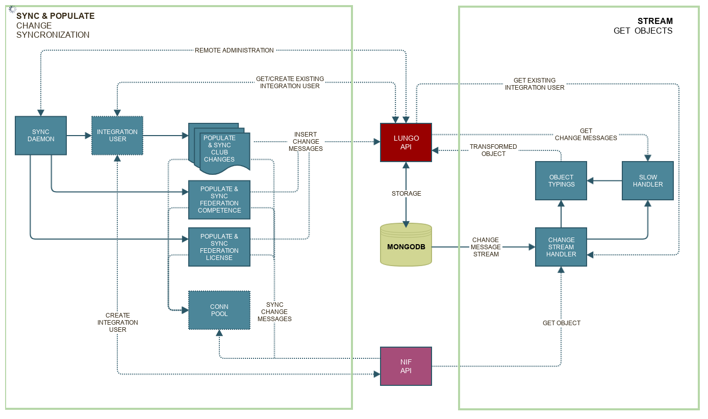

.. NIF Integration documentation master file, created by
   sphinx-quickstart on Sat Nov  3 14:21:12 2018.
   You can adapt this file completely to your liking, but it should at least
   contain the root `toctree` directive. .. :caption: Contents: :modules:

Welcome to NIF Integration's documentation!
===========================================

.. danger::
   Incomplete documentation before 0.1.0 is released

.. attention::
   Requires Python >= 3.6

***************
NIF Integration
***************
This project is an integration with the synchronization api provided by NIF for the NLF membership api.

Listen on changes::

   from stream import NifStream
   stream = NifStream()
   stream.run()

Start synchronization daemon::

   python syncdaemon.py

Start synchronization workers::

   import Pyro4
   proxy = Pyro4.Proxy('PYRO:nif.integration@localhost:5555')
   proxy.start_workers()  # Returns immediately with None
   proxy.get_workers_status()  # Returns list of statuses
   proxy.shutdown()  # Shutdown all workers, rpc and exit daemon context

.. toctree::
   :maxdepth: 1
   :caption: Sync & stream

   integration
   syncdaemon
   sync
   stream

.. toctree::
   :maxdepth: 1
   :caption: Api

   eve_api
   nif_api
   typings

.. toctree::
   :maxdepth: 1
   :caption: Tools

   app_logger
   organizations
   reset_api

.. toctree::
   :maxdepth: 1
   :caption: Settings

   settings-default

Indices and tables
==================

* :ref:`genindex`
* :ref:`modindex`
* :ref:`search`
